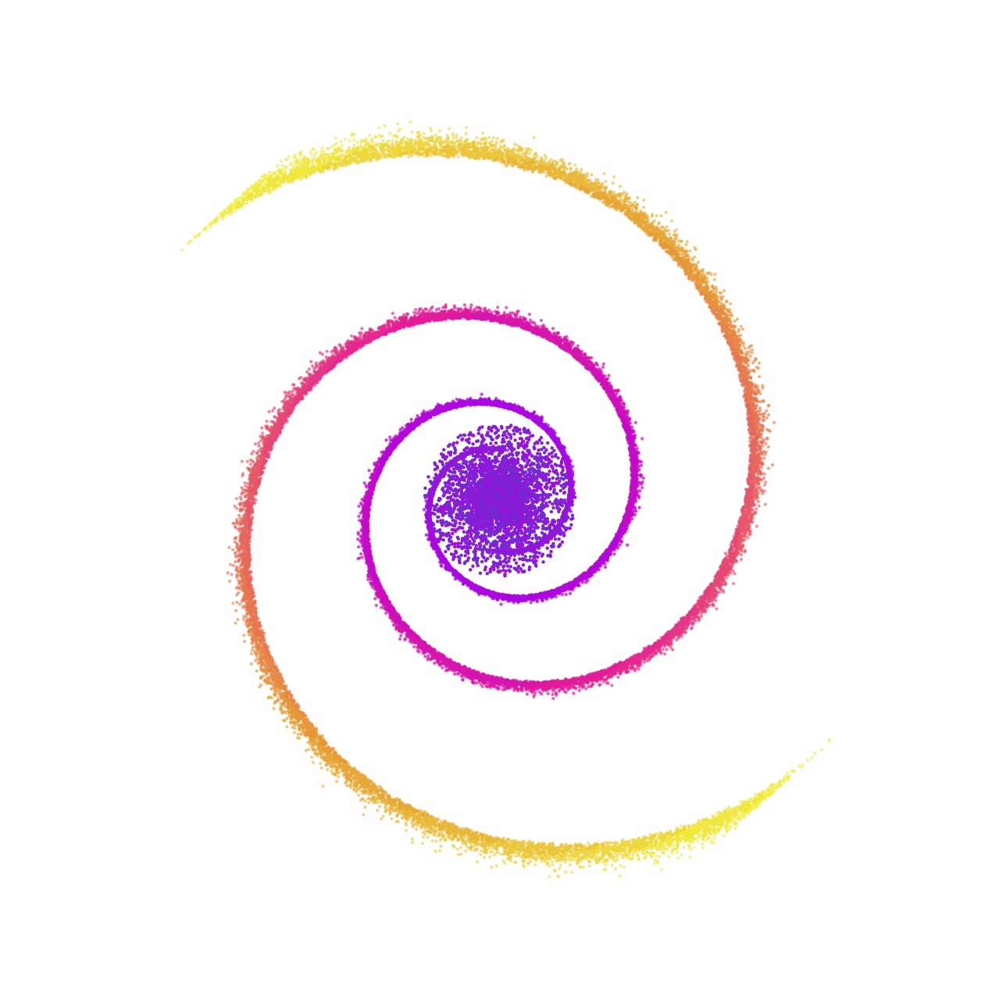

<h1 align="center">🌌 Galaxy Morphology Evolution</h1>


<p align="center">
  
</p>

<p align="center">
  A visually rich simulation and analysis of galaxy evolution using deep learning and scientific modeling.
</p>

---

## 🪐 Overview

**Galaxy Morphology Evolution** is a research-based project that leverages **Variational Autoencoders (VAE)** and **Physics-Informed Neural Networks (PINNs)** to simulate and understand the visual evolution of spiral galaxies. Inspired by astronomical datasets and powered by AI, this model captures the structural transformation of galaxies over time.
This project uses data from **Galaxy Zoo**, applies scientific learning frameworks, and produces visually stunning galaxy morphing simulations like the one above.

---

## ✨ Features

- 🌠 **Spiral Galaxy Simulation** with vibrant evolution
- 📊 Uses **9 key morphological features** from Galaxy Zoo
- 🧠 Combines **VAE** for latent representation + **PINN** for realistic dynamics
- 🔍 Includes **feature visualization**, **loss plots**, and **training logs**
- 🎞️ Generates **GIF animation** of evolving galaxies
- 💾 Trained using **Adam optimizer** with fine-tuned loss weights

- **Input Features:**
  - Smoothness, Roundness, Bulge Prominence, Spiral Arms, Central Brightness, and more (from Galaxy Zoo)
- **VAE:**
  - Learns latent galaxy representations
- **PINN:**
  - Injects physical constraints to maintain realistic spatial evolution
- **Training:**
  - Optimized using **reconstruction loss**, **KL divergence**, and **physics-based constraints**

---

## 📊 Dataset: Galaxy Zoo

- **Source**: [Galaxy Zoo 2](https://data.galaxyzoo.org/)
- **Size**: ~250,000 galaxy images with crowd-sourced labels

---

## 🧬 Model Architecture

### 📦 Variational Autoencoder (VAE)
- Encodes galaxy features into a latent space.
- Enables sampling and interpolation between galaxy states.

### 🌌 Physics-Informed Neural Network (PINN)
- Models temporal evolution using physical laws.
- Regularizes predictions to stay realistic over time.

---

## 🎯 Research Goals

- Simulate galaxy evolution realistically using both data and physics.
- Create smooth animations of spiral galaxy changes.
- Test combinations of morphology parameters and visualize transitions.

---

## 🔧 How to Run

```bash
# 1. Clone the repo
git clone git@github.com:shambhaviraj20/Galaxy-Morphology-Evolution.git
cd Galaxy-Morphology-Evolution

# 2. Install dependencies
pip install -r requirements.txt

# 3. Train the models
python galaxy-2.py

# 4. Generate simulation
python test.py

## 🧪 Sample Results
🌠 Evolving spiral galaxies with dynamic arm distortion, rotation, and fading.
🌌 Morphology variations based on bulge size and spiral arm prominence.
🎞️ Output: GIFs that simulate realistic changes in galaxy structure.

## 🚀 Future Scope
- Integrate with telescope image streams for real-time learning.
- Add astrophysical equations for dark matter, gravity, etc.
- Build a web-based galaxy morph simulator.

## 👩‍💻 Contributors
- Shambhavi Raj
- Shardul Bangale
- Aaditya Jain

## 🙏 Acknowledgements
- Galaxy Zoo for the annotated data.
- Kingma & Welling for VAEs.
- Raissi et al. for PINNs.
- PyTorch, SciPy, and the astronomy ML community.

## 📜 License
This project is licensed under the MIT License.

<p align="center"><b>Made with 💫 by Shambhavi</b></p> ```

